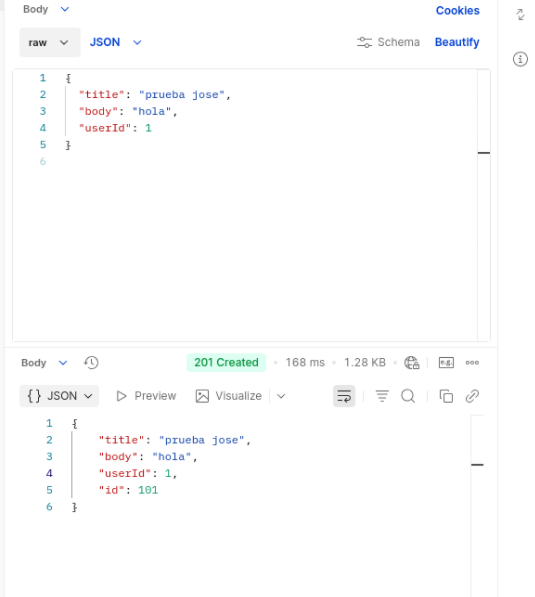
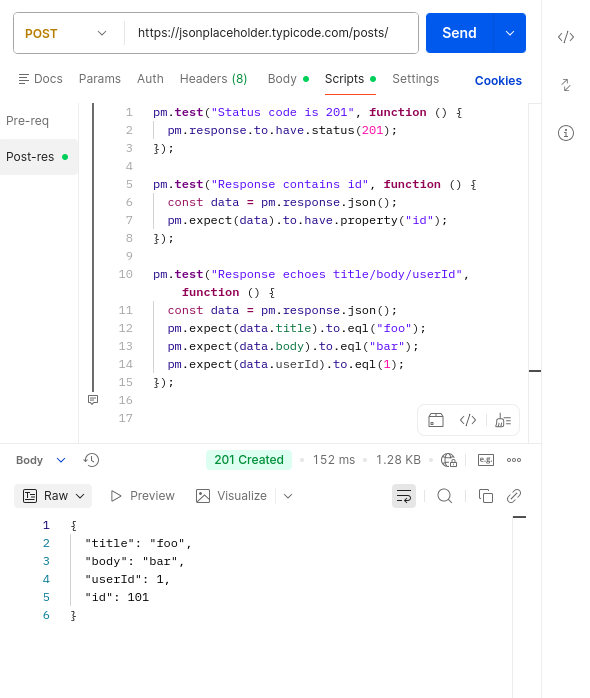

## JSONPlaceholder — Postman API Testing

Colección de Postman para practicar requests y tests básicos contra la API pública de JSONPlaceholder.

### Qué incluye
- GET `/posts` + tests:
  - Status code = 200
  - Response es un array no vacío
- POST `/posts` + tests:
  - Status code = 201
  - Response contiene `id`
  - La response refleja `title/body/userId`

### Cómo usar
1. Importa el archivo: `postman/JSONPlaceholder.postman_collection.json`
2. Ejecuta las requests desde Postman (Send) o con Runner.
3. Revisa la pestaña **Test Results**.

### Evidencias (capturas)
**POST /posts — Body enviado + 201 Created**

**POST /posts — Tests pasando**

**GET /posts — 200 OK**

## Recursos
- JSONPlaceholder: https://jsonplaceholder.typicode.com/
- Postman (Docs): https://learning.postman.com/
